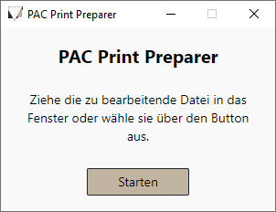

# PAC Print Preparer

This tool prepares the results from https://www.kompetenzanalyse-pac.de/ for duplex printing by removing the cover pages and inserting empty pages if needed.
It isonly tested for the "Potenzialanalyse 2022".

You can choose a file via dialog, drag-and-drop onto the window or executable. It will be saved in the original files directory with "\_bereinigt" added to the end.
